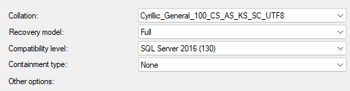

# **Reflection document**

## Info
- Na het gesprek verwerkt je de feedback van de coach in de reflectie met een nieuwe commit `Zelfreflectie 1/2/… - Post` 

## Zelfreflectie Week 1 - Post
#### Waar sta je globaal?
- Alles is in principe afgewerkt van deel 2.
#### Wat loopt goed en minder goed? 
- Tweemaal dubbele quotes in de XML files dit lukt ons niet.
#### Hoe verloop de samenwerking?
- Goed, we hebben een goede verdeling van de taken.
#### Progress per deel(buikgevoel, %).
- Deel 0 Probleemdomein: **100%**
- Deel 1 Opzetten Operationeel Systeem: **100%**
- Deel 2 Transformatie: **90%**
- Deel 3 Datawarehouse: **10%**
- Deel 4 Database Optimalisatie: **0%**
- Deel 5 NoSQL Cases: **0%**
#### Eventuele vragen voor je coach?
- /

## Zelfreflectie Week 2 - Post
#### Waar sta je globaal?
- We zijn ongeveer In de helft geraakt van deel 3.
#### Wat loopt goed en minder goed? 
- Slowly shifting dimensions is vrij moeilijk om te implementeren.
- Elias & Kobe zijn beter aan het worden in Talend.
- Kobe heeft uitgevonden welke encoding we nodig hebben om onze data juist in te lezen. Dit verliep eerst minder goed.

    
#### Hoe verloop de samenwerking?
- Goed, we hebben een goede verdeling van de taken.
#### Progress per deel(buikgevoel, %).
- Deel 0 Probleemdomein: **100%**
- Deel 1 Opzetten Operationeel Systeem: **100%**
- Deel 2 Transformatie: **100%**
- Deel 3 Datawarehouse: **60%**
- Deel 4 Database Optimalisatie: **0%**
- Deel 5 NoSQL Cases: **0%**
#### Eventuele vragen voor je coach?
- Moeilijk in te schatten wat er in deel 3 al klaar moet zijn voor sprint 1.

## Zelfreflectie Week 3 - Post
#### Waar sta je globaal?
- Op het pad van geen examen afleggen.
#### Wat loopt goed en minder goed? 
- De feiten tabel maken verloopt iets moeilijker, voor de rest verloopt alles heel goed!
#### Hoe verloop de samenwerking?
- Heel aangenaam.
#### Progress per deel(buikgevoel, %).
- Deel 0 Probleemdomein: **100%**
- Deel 1 Opzetten Operationeel Systeem: **100%**
- Deel 2 Transformatie: **100%**
- Deel 3 Datawarehouse: **80%**
- Deel 4 Database Optimalisatie: **0%**
- Deel 5 NoSQL Cases: **0%**
#### Eventuele vragen voor je coach?
- /

## Zelfreflectie Week 4 - Post
#### Waar sta je globaal?
- Optimalisatie is af en we zijn begonnen aan nosql.
#### Wat loopt goed en minder goed? 
- Optimalisatie verliep redelijk vlot, partitionering was iets ingewikkelder.
#### Hoe verloop de samenwerking?
- Samenwerking verloopt zeer goed en aangenaam.
#### Progress per deel(buikgevoel, %).
- Deel 0 Probleemdomein: **100%**
- Deel 1 Opzetten Operationeel Systeem: **100%**
- Deel 2 Transformatie: **100%**
- Deel 3 Datawarehouse: **100%**
- Deel 4 Database Optimalisatie: **100%**
- Deel 5 NoSQL Cases: **85%**
#### Eventuele vragen voor je coach?
- /

## Zelfreflectie Week 5 - Post
#### Waar sta je globaal?
- Alles is helemaal afgerond.
#### Wat loop goed en minder goed? 
- Alles loopt helemaal goed af en toe een klein probleempje met GIT.
#### Hoe verloop de samenwerking?
- Lekker gezellig.
#### Progress per deel(buikgevoel, %).
- Deel 0 Probleemdomein: **100%**
- Deel 1 Opzetten Operationeel Systeem: **100%**
- Deel 2 Transformatie: **100%**
- Deel 3 Datawarehouse: **100%**
- Deel 4 Database Optimalisatie: **100%**
- Deel 5 NoSQL Cases: **100%**
#### Eventuele vragen voor je coach?
- **Dienden wij nog een examen af te leggen, of is de afronding van dit project voltooid?**